# VertexUI

A small dark-UI toolkit for [Dear ImGui](https://github.com/pthom/imgui_bundle)
(imgui-bundle), for desktop tools that need to look deliberate rather than
default — and to keep looking that way while they run unattended for hours.

MIT licensed. No assets, no icon font, no audio files — everything is
generated or drawn, so vendoring the folder is the whole install.

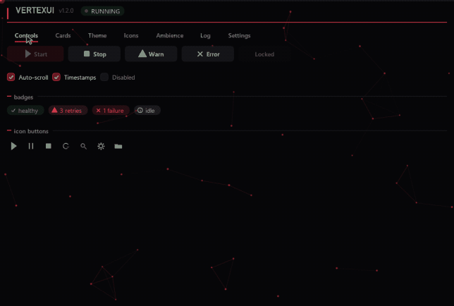

*The demo, running. `python -m vertexui.demo`*

| module | what it is |
|---|---|
| `theme` | colour/shape tokens, user presets on disk, accent derivation |
| `anim` | frame-rate-independent easing for immediate-mode UI |
| `sound` | synthesised interface cues — no audio files to ship |
| `fonts` | real system typefaces, seven roles, in pairs that read |
| `icons` | 16 vector icons drawn from primitives — no font, no atlas |
| `widgets` | buttons, tabs, sliders, colour picker, badges — all animated |
| `cards` | the panels an interface is built out of, in four styles |
| `logview` | a log pane that glides instead of yanking to the bottom |
| `settings` | a ready-made settings panel, and the object behind it |
| `toasts` | click-through notifications drawn *over another application* |
| `effects` | ambient particles behind — and over — the interface |
| `backdrop` | a themed shader backdrop under the whole window |

Try it — every widget, the icon sheet, the card styles, live theming, the
shader scenes and the log glide:

```bash
pip install "vertexui[all] @ git+https://github.com/D4ead3ye/vertexui"
python -m vertexui.demo
```

## Minimal app

```python
from imgui_bundle import hello_imgui
import vertexui as vui

state = {"on": False, "tab": 0}

def gui():
    state["tab"] = vui.widgets.tabs("main", ["Home", "Settings"], state["tab"])
    if vui.widgets.button("Start", primary=True):
        state["on"] = True
    state["on"] = vui.widgets.checkbox("Enabled", state["on"])
    vui.end_frame()          # lets the app idle once motion has settled

params = hello_imgui.RunnerParams()
params.callbacks.show_gui = gui
vui.install(params, theme_=vui.theme.NOIR_RED)
hello_imgui.run(params)
```

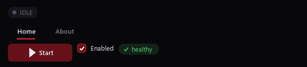

`install()` wires the theme, fonts, sounds and the idling rule in one call.
That last one is easy to miss: an app that idles to save power renders
every ease at the idle frame rate, and every animation looks broken.

## Theming

Tokens are semantic (`accent`, `surface`, `danger`), never descriptive
(`red`, `dark_grey`) — a palette named after what colours *are* stops
making sense the moment you swap it.

```python
from dataclasses import replace
MINE = replace(vui.theme.NOIR_RED, accent=vui.theme.rgb("#7c3aed"))
vui.theme.use(MINE)
```

Presets: `NOIR_RED`, `NOIR_BLUE`, `SLATE_LIME`, plus any the user saves.
`theme.apply_style()` also pushes the palette into ImGui's own style, so
stock widgets (inputs, tables, scrollbars) match the drawn ones.

Pick one accent and the variants derive from it — asking a user to choose
three colours that relate correctly is asking them to do the designer's
job:

```python
t = theme.NOIR_RED.with_accent(theme.rgb("#852ebd"))
theme.save_preset(t, "my-purple")            # -> %APPDATA%/vertexui/themes
theme.list_presets()                          # built-ins, then the user's
```

`Theme.scaled(text=1.2, rows=1.25)` adjusts type size and density without
touching colour.

## Typography

Two faces, not one. One face doing every job is most of what makes an
interface look like a default — a body face set at 35px is just big body
text, where a display face set at 35px reads as an instrument.

Seven roles are wired, and a settings panel drives them from three choices:

| role | what it is for |
|---|---|
| `ui` | body text, and the default |
| `semi` | headings and emphasis — the bold of the interface face |
| `title` | the display face at heading size |
| `mono` | logs and tables, where things have to line up |
| `label` | the tracked micro-labels on cards |
| `big` / `huge` | a readout meant to be seen from across the room |

```python
faces = fonts.build_faces(ui="Segoe UI Variable",
                          display="Bahnschrift",     # DIN-derived, technical
                          mono="Cascadia Mono")
vui.install(params, faces=faces)
...
with fonts.use("huge"):
    imgui.text("210")
```

`DISPLAY_FACES` carries a **per-face size scale**, because faces disagree
about how much of the em the x-height takes: Bahnschrift at a matched em
size renders noticeably larger than the body face, so it is scaled to 0.88
and card layouts built around it stay intact.

ImGui has no letter-spacing, so tracked capitals are drawn a glyph at a
time — three to seven characters each, and the tracking is most of what
separates a laid-out panel from a stack of default text:

```python
widgets.caps(dl, x, y, "NOZZLE", colour, track=1.5)
widgets.caps_width("NOZZLE")        # to right-align one
```

## Animation

```python
hot = vui.anim.to(f"btn:{label}", 1.0 if hovered else 0.0, speed=16)
```

The chase is exponential on the frame delta, so it takes the same
wall-clock time at 30fps and 144fps. `anim.settled()` reports whether
anything is mid-transition, which is what `end_frame()` uses to decide
when idling is safe.

Also: `ease_out`, `ease_in_out`, `pulse()` for "this is alive" indicators.

Two pieces of motion that are worth having ready-made:

```python
widgets.progress_hairline(0.62)      # full width, along the very top edge
```

The one number worth seeing from the other side of the room, and up against
the edge it costs no layout at all. The bloom on the leading edge is what
makes the eye find it moving rather than having to read it.

```python
wipe = widgets.Transition()
...
wipe.to(self.screen)     # anywhere before drawing
... draw the screen ...
wipe.draw()              # last thing in the frame
```

Swapping the whole window from one screen to another reads as a glitch
without a beat in between; a short fade over the top reads as navigation.

## Widgets

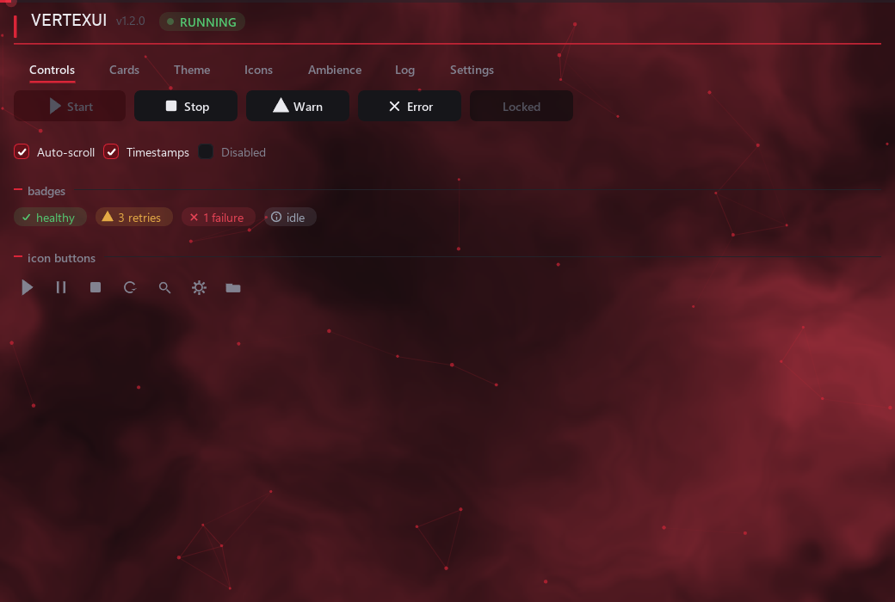

Drawn rather than styled. ImGui's own widgets take their geometry and
colour from the global style, which is tuned for one shape of control;
restyling them gets you a themed panel that still snaps between states.
These draw themselves, so hover, press and selection each ease
independently, and every one reads the active theme and plays from the
active sound set.

| | |
|---|---|
| `button` | with an optional icon, a primary variant, and a disabled state |
| `checkbox` | the tick draws itself, so it eases in rather than appearing |
| `tabs` | the indicator spans the label, not the cell |
| `slider` / `combo` | themed, and keyed so two can share a label |
| `color_button` | opens ImGui's picker in a popup |
| `badge` | a status pill; the icon comes from the kind |
| `icon_button` | square, with a tooltip |
| `status_pill` | the IDLE/RUNNING lozenge, with a pulsing dot |
| `activity_rule` | a rule that sweeps while something is running |
| `section` | accent tick, label, hairline out to the edge |
| `underline` / `label_underlined` | a rule matched to the word's own width |

Every widget takes a `key=` when the label is not unique. Widget identity
in ImGui comes from the label, and two controls sharing one in the same
window is a hard error rather than a cosmetic one.

## Cards

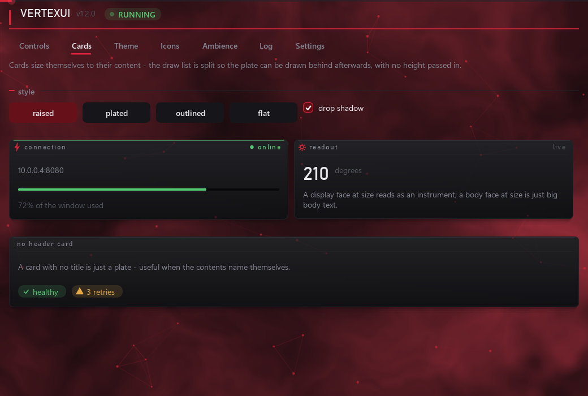

`widgets.section` draws a label and a rule floating in the gaps *between*
things, which reads as captions around boxes. A card reads as an instrument
with a name on it.

| style | |
|---|---|
| `raised` | gradient fill, border, a hairline of light inside the top edge, drop shadow |
| `plated` | flat fill, border, accent rule along the top |
| `outlined` | border only — whatever is behind shows straight through |
| `flat` | fill only, no edges |

Four genuinely different grounds rather than four names for one: the choice
decides whether a card has a fill at all, and so how much of a `backdrop`
or `effects` pass comes through the interface.

```python
cards.set_style("raised", shadow=True)

with cards.card("connection", icon="bolt", right="online",
                right_col=t.ok, edge=t.ok) as c:
    imgui.text("10.0.0.4:8080")
    cards.meter(dl, x, x + c.width, y, 0.72, t.ok)
```

The card sizes itself to its content. A background cannot be drawn until
the height is known, and in immediate mode that is not until the content
has been drawn — so the draw list is **split in two**: content goes on the
front channel, the plate is drawn on the back one afterwards, and merging
puts them in the right order. No measuring pass, no height passed in, and
no drift when a label changes length.

`edge` colours the accent rule along the top, so a panel says what it is
doing from the corner of your eye.

**Rounded gradients.** ImGui's own multi-colour rect is square-cornered, so
the first attempt at this concluded it was impossible. It is not: draw the
rounded fill normally, then re-colour the vertices it just emitted with
`ShadeVertsLinearColorGradientKeepAlpha`. `KeepAlpha` is the part that
matters — it lerps RGB along an axis and leaves each vertex's alpha alone,
so the anti-aliased corner fringe keeps its coverage and picks up the
gradient with everything else.

**Shadows** are three stacked rounded rects, each fainter and larger —
cheaper than a blur and, at this size, indistinguishable from one.

## Icons

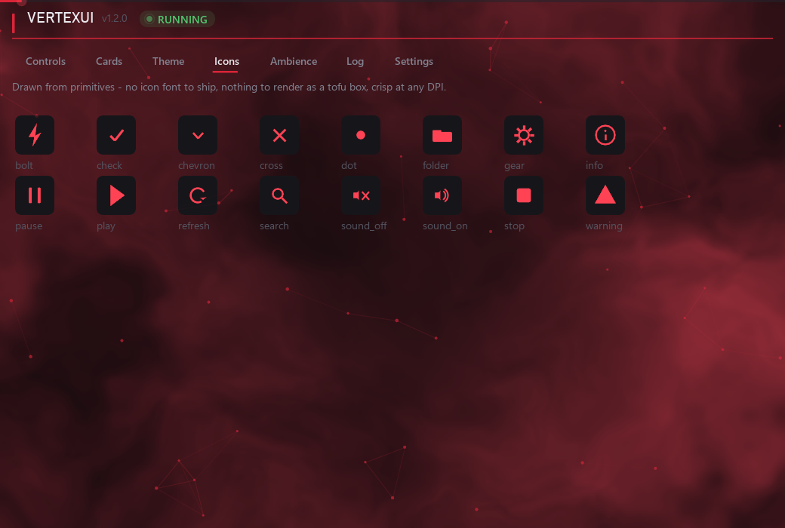

Sixteen drawn from primitives: `play stop pause check cross warning info
gear folder refresh search dot chevron bolt sound_on sound_off`. They take
the theme's colour, stay crisp at any DPI, and cannot render as a tofu box
because there is no font involved.

```python
widgets.button("Start", icon="play", primary=True)
widgets.icon_button("gear", tooltip="Settings")
widgets.badge("3 retries", "warn")           # icon picked from the kind
icons.draw("bolt", dl, x, y, 12, colour)     # or draw one yourself
```

Add your own by putting a function in `icons.ICONS` with the signature
`(dl, cx, cy, r, col)`.

## Log view

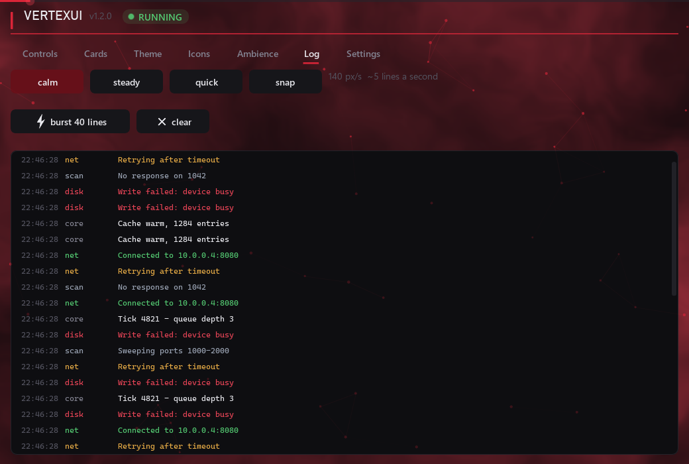

Auto-scroll usually means "jump to the bottom every frame", which makes a
busy log unreadable — lines are gone before you can read them. This glides:

| speed | px/s | roughly |
|---|---|---|
| `calm` (default) | 140 | 7 lines a second |
| `steady` | 260 | 13 lines a second |
| `quick` | 520 | 26 lines a second |
| `snap` | — | straight to the bottom, no glide |

```python
log = logview.LogView(speed="calm")
log.add("Connected", kind="ok", tag="net")
log.draw()
```

Scrolling up by hand stops the follow; scrolling back to the bottom
resumes it. Optional timestamp and tag columns, a filter, and a
replaceable `colour_for` rule. Rows are emitted through `ListClipper`, so a
2000-line buffer costs the same as a screenful.

## Backdrop

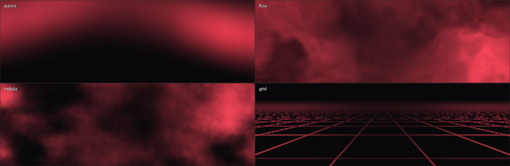

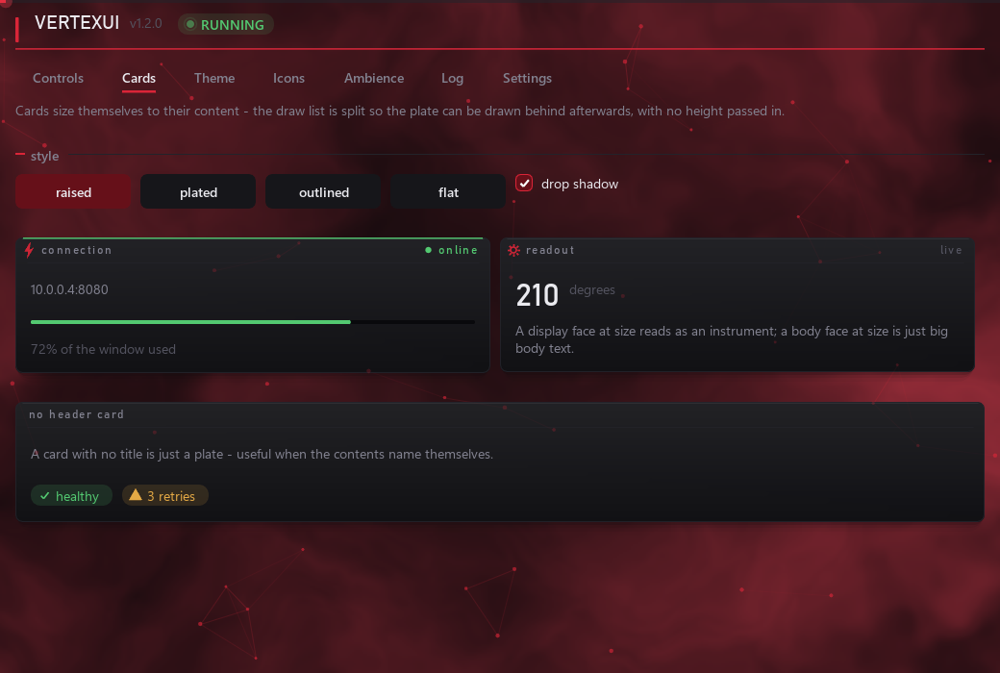

A fragment shader over a fullscreen triangle, rendered to its own
framebuffer and blitted beneath the entire interface. This is the one thing
the draw list cannot do: a particle costs a draw call each, so that tops out
at a few hundred dots, while anything continuous — a gradient that moves,
cloud, a horizon, light that pools — is per-pixel work.

Six scenes, all tinted from your accent colour: `aurora`, `plasma`, `flow`,
`nebula`, `grid`, `warp`.

```python
bd = backdrop.Backdrop("flow", intensity=0.6)
def gui():
    bd.draw()            # first thing in the frame
    ...
```

- **One program, not six.** Scenes branch on a uniform, so switching is not
  a recompile and a settings panel can flick between them live.
- **Half resolution on each axis** — a quarter of the pixels. Every scene
  is soft by construction and nothing in them survives close inspection.
- **Vignetted, always.** The panels sit in the middle and the backdrop has
  no business competing with them for contrast there.
- **Opaque.** It composites the theme background itself rather than
  blending over the window fill, which keeps one guess out of the colour
  maths — so it must be drawn *before* any content.
- **Fails once, then stops.** A backdrop is decoration; it does not get to
  throw from the frame loop sixty times a second. `Backdrop.error` says
  what went wrong, and `active` goes False.
- **Puts the context back.** Framebuffer, viewport, program and the depth
  and blend enables are all restored. Leaving the viewport at half
  resolution is invisible here — ImGui's backend sets its own before it
  draws — and breaks the next renderer to share the context, which is
  exactly the kind of bug that gets blamed on that renderer.

Needs PyOpenGL: `pip install vertexui[backdrop]`. Without it, `active` is
False and `draw()` is a no-op.

## Particle effects

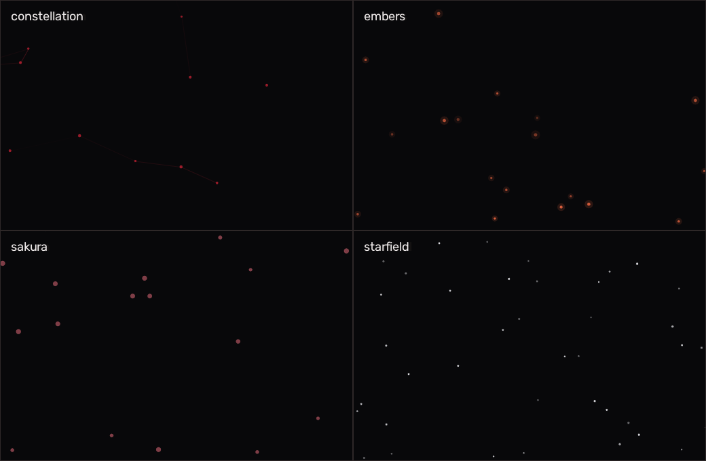

Ten of them: `fireflies`, `starfield`, `constellation`, `rain`, `sakura`,
`sparkles`, `bubbles`, `embers`, `orbits`, `dust`.

- `embers` rise, wander and flicker, dimming as they climb.
- `dust` runs three depths at different speeds — parallax is the whole
  trick, and identical motes at one speed read as noise.
- `orbits` has no integration at all: position is a closed form of the
  clock, so it cannot drift out of shape however long it runs.

**Paint it twice from one simulation** — once behind the content and once
over it at a fraction of the alpha. Behind only, the effect shows in the
gaps between panels and nowhere else, which on a dense screen is a thin
border of weather around an interface that does not participate in it.
Painted again over the top, it drifts across the cards and reads as one
atmosphere.

```python
moving = fx.step(now, dt)
if moving:
    fx.paint(dl, 0, 0, w, h, now, 1.0)      # behind
... draw your panels ...
if moving:
    fx.paint(dl, 0, 0, w, h, now, 0.42)     # and over the top
```

`step()` and `paint()` are separate precisely so that painting twice does
not advance the motion twice. The over-pass goes on the window's own list
after the content, so it sits above everything drawn that frame but still
below popups — a modal has to stay readable.

## Sound

Cues are generated as WAV bytes on first use — nothing to ship, nothing to
lose track of in a frozen exe.

```python
vui.sound.use(vui.sound.SoundSet(volume=0.16))
vui.sound.play("ok")
```

The default set is deliberately dull and low. Three things learned the
hard way while tuning it:

* **pitch, not volume, is what makes a cue feel sharp.** Quiet high beeps
  still cut through; the whole set sits low and is low-passed at 900 Hz.
* **a falling pitch reads as a physical knock.** The same tone held flat
  reads as an alert.
* **fade both ends.** A waveform starting or stopping at non-zero
  amplitude clicks, and that click is most of what "harsh" means.

Four named sets, and `SETS` is a plain dict you can add to:

| set | |
|---|---|
| `soft taps` | low tonal knocks — the default |
| `breeze` | filtered noise, no attack to flinch at |
| `crisp` | brighter and shorter |
| `custom .wav` | your own files, per cue |

```python
sound.install("breeze", volume=0.16)
```

**`breeze` is noise, not tone.** A band of filtered noise steered by
overlap-add FFT under a long raised-cosine envelope reads as breath rather
than as a knock — right for something open beside you for nine hours, where
a tonal cue is a small tap on the shoulder every time. Identity comes from
where the band sits and which way it sweeps, plus a quiet sine underneath
so each cue has a pitch you can name.

**`custom .wav`** reads `<cue>.wav` from `%APPDATA%/<app>/sounds`, **per
cue** rather than all-or-nothing — replacing just the click and leaving the
rest synthesised is the common case, and a set that stayed silent until all
seven files existed would be useless for it. `export()` writes the
synthesised cues out as real files to replace, because hearing the shape
you are replacing is most of knowing what to record. A file that is not
really a WAV is reported on the set's `bad` dict, not raised — it must not
take the interface silent.

Seven cues: `hover`, `click`, `ok`, `warn`, `error`, `toast_in`,
`toast_out`.

## Toasts

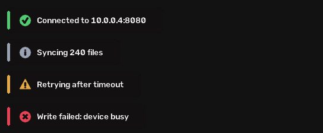

A separate always-on-top window that never takes focus and never receives
a click, so it can report over a fullscreen application.

```python
tray = vui.toasts.Toasts(anchor_titles=["My App"], on_status=print)
tray.start()
tray.notify("ok", "Connected")
```

Kinds: `ok`, `warn`, `error`, `info`. Repeats within a couple of seconds
collapse into one with a counter. It has no ImGui dependency and runs
happily in a process with no GUI at all.

Two traps worth knowing, both of which fail *silently*:

* the window **must** pump its message queue. One that doesn't is a hung
  window as far as Windows is concerned — and `GetWindowText` sends
  `WM_GETTEXT` to windows in the same process, so the owning app can
  deadlock enumerating windows against its own overlay.
* `UpdateLayeredWindow` wants **premultiplied alpha**, or the boxes wash
  out pale instead of reading as translucent.

`on_event("in"|"out", kind, text)` fires when a toast appears and when it
starts sliding away, which is what arrival and departure cues hang off. It
runs on the toast thread and is guarded — a callback that raises would
otherwise stop the overlay repainting and strand the frame it was drawing.

```python
tray = toasts.Toasts(on_event=lambda phase, kind, text:
                     sound.play("toast_in" if phase == "in" else "toast_out"))
```

A third trap, also silent: **clearing a layered window by blitting a
transparent surface is not reliable.** On some compositors
`UpdateLayeredWindow` with an all-zero bitmap leaves the previous frame
painted, which strands a toast on the desktop until the process dies. The
window is hidden outright when the list empties instead, which nothing
ignores.

`exclude_from_capture=True` (the default) hides the window from screen
capture, so an app that reads the screen never photographs its own
notifications. On a few graphics configurations that flag stops the window
drawing entirely — hence the switch, and `on_status` to report which.

## Settings panel

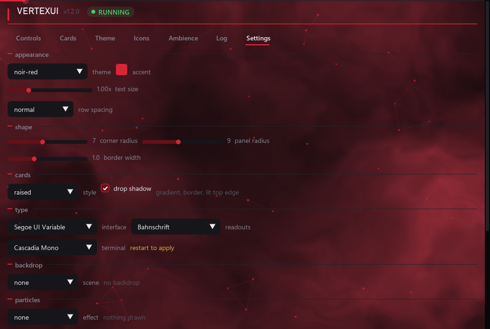

```python
st = settings.Settings.load(app="myapp")
st.apply(log)
...
settings.panel(st, log, extra=my_own_rows)
```

Theme picker, accent colour picker, text size, row density, log speed,
sound toggle and volume, and save/load/delete of user presets. Settings
live in `%APPDATA%/<app>/settings.json`, presets in
`%APPDATA%/<app>/themes/*.json` — per-user, because a program directory is
often read-only and a preset is user data.

A corrupt settings file costs you your preferences, not your program: both
loaders fall back to defaults rather than raising.

## Install

```bash
pip install git+https://github.com/D4ead3ye/vertexui
```

Or drop the `vertexui/` folder into your project and import it — there is
nothing to build and no data files to find at runtime, which is also what
makes it survive PyInstaller without a `--add-data` line.

## Requirements

`imgui-bundle` and `numpy`. `opencv-python` for `toasts`, `PyOpenGL` for
`backdrop` — `pip install vertexui[all]` for both.

`toasts` and `sound` are Windows-only (layered windows and `winsound`);
`theme`, `anim`, `fonts`, `icons`, `widgets`, `cards`, `effects`,
`backdrop` and `logview` are cross-platform.

`toasts`, `effects` and `backdrop` are imported on first touch rather than
up front, so a project that wants none of them pays for none of them.

Every module degrades rather than raising: a missing font role renders in
the default face, an unknown icon draws nothing, and a machine with no
audio device disables sounds after reporting why.

## Contributing

Issues and pull requests welcome. Two conventions worth knowing before you
open one:

* **colour names are semantic.** `accent`, `surface`, `danger` — never
  `red` or `dark_grey`. A palette named after what the colours *are* stops
  making sense the moment somebody swaps them.
* **nothing raises from a draw call.** A frame that throws takes the whole
  window down, so unknown icons, missing fonts and absent audio devices all
  degrade quietly instead.

`examples/` runs each piece on its own — `minimal.py`, `notifications.py`,
`ambience.py`.

`python tools/smoke.py` draws every screen in every state — each tab, each
card style, each effect, with the cursor swept over a grid — and fails if
any frame raises. It exists because a wrong argument order sits silent until
the one frame that hits it: `add_rect` in this binding takes
`(rounding, thickness, flags)` rather than the C++ order, and the resulting
`TypeError` only ever fired on a frame where a widget was hovered.
`python tools/shots.py` regenerates every still in `docs/`, and
`python tools/spotlight.py` re-records the looping clip at the top — it
records and encodes as separate stages, so re-encoding to tune the palette
does not mean driving the demo again.

## Licence

MIT — see [LICENSE](LICENSE).
